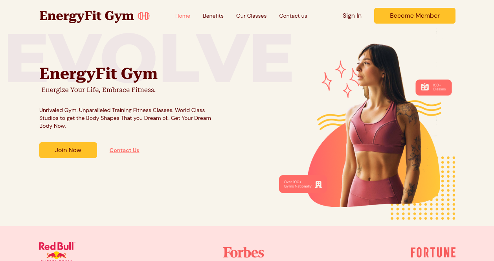
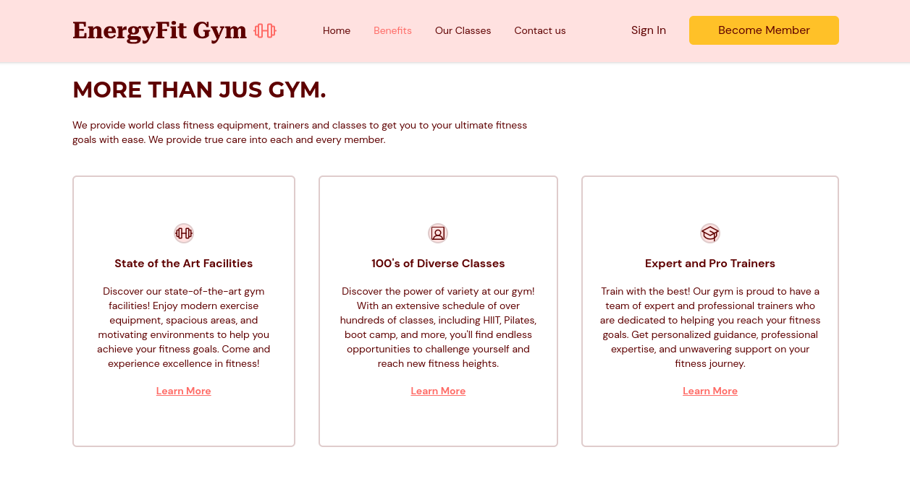
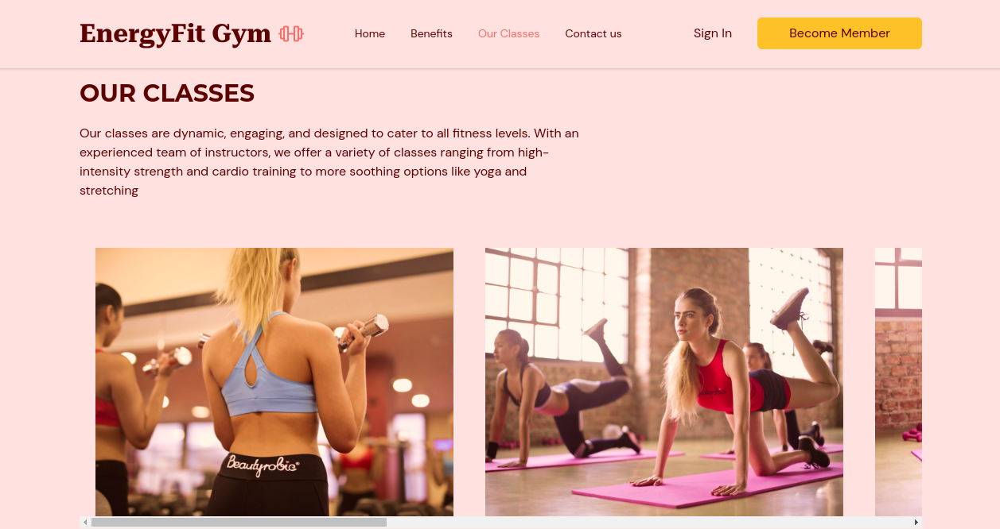

# Gym-WebSite
#### WebSite OnePage desenvolvido com a finalidade de aprimorar o dominío sobre o Front-End.

### Tecnoligias utilizadas no projeto:
 * ReactJs(Vite)
 * Tailwindcss
 * HTML5
 * react-hook-form

### Passo-a-passo para rodar a aplicação:

1. Entre na gym-typescript;
2. use o comando: ***yarn*** ou ***npm install/i*** para instalar os pacotes;
3. use o comando: ***yarn dev*** ou ***npm run dev*** para rodar a aplicação.